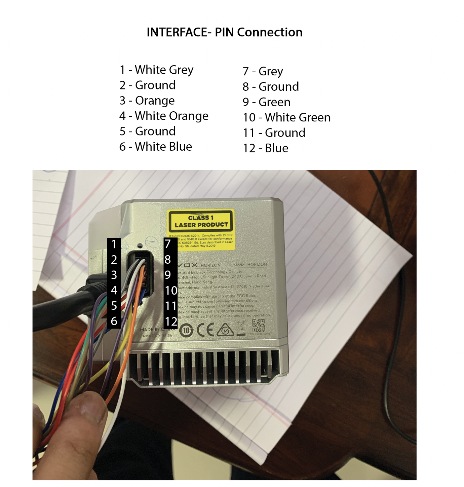

# Livox Horizon 

1. __Lidar-Interface Box Connection__
- The Covering mesh acts as the ground wire and connects to 4 of the 16 pins. 
- The 16 pin provided with lidar natively is put inside the interface box due to the interface pins being too compact to fit the jumpers. 

